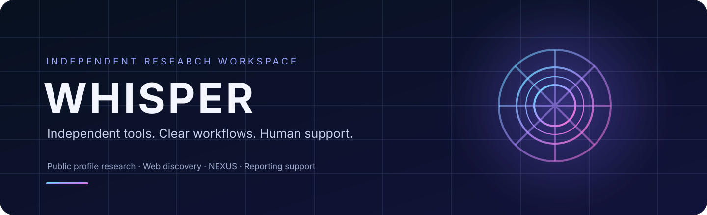

# WHISPER

### Independent tools. Clear workflows. Human support.

Explore public profile signals, search the open web, and find the right reporting workflow from one focused workspace.

[🌐 Open Whisper](https://whi3per.com/) · [✈️ Contact the team](https://t.me/WHI3PER) · [📣 Follow updates](https://t.me/whi3per_com)

---

## One workspace, many ways to explore

Whisper brings focused research pages together with **NEXUS**, its unified research workspace. Choose a platform-specific tool for a direct workflow, or start with broader discovery and follow the available public context.

| Workspace | What it is for |
| --- | --- |
| [Instagram](https://whi3per.com/IG-OSINT/) | Explore public profile signals and linked details. |
| [Facebook](https://whi3per.com/FB-OSINT/) | Review profile context and available linked information. |
| [TikTok](https://whi3per.com/TT-OSINT/) | Explore public account details and visible signals. |
| [Snapchat](https://whi3per.com/SC-OSINT/) | Review available profile information and public assets. |
| [Telegram](https://whi3per.com/TG-OSINT/) | Explore public profile, channel, and activity context. |
| [Discord](https://whi3per.com/DC-OSINT/) | Review supported public profile information. |
| [X](https://whi3per.com/X-OSINT/) | Explore public account details and profile context. |
| [Phone research](https://whi3per.com/PH/) | A phone-number-focused workflow for available public links and signals. |
| [Web discovery](https://whi3per.com/Dork/) | Use search patterns to discover public pages across supported networks. |
| [NEXUS](https://whi3per.com/NEXUS/) | Bring multiple supported public signals into one research workspace. |

## More than a collection of lookup pages

- **Start quickly:** focused tools make it easy to choose a workflow and begin.
- **See context:** review structured details, public signals, and linked information when a source provides them.
- **Get useful guidance:** smart suggestions help orient visitors around the available workflows.
- **Understand the limits:** the site describes the boundaries of automated results and source coverage.
- **Find reporting help:** dedicated [TikTok](https://whi3per.com/) and [Snapchat](https://whi3per.com/) reporting desks support legitimate cases. Contact the team with relevant links and the outcome you need.
- **Talk to a person:** reach the project team directly on [Telegram](https://t.me/WHI3PER).
- **Keep up with the project:** follow [Telegram updates](https://t.me/whi3per_com), [YouTube](https://youtube.com/@whi3per_com), and [TikTok](https://tiktok.com/@whi3per.com).

## Made for practical research

Whisper is designed for people who want a clear starting point for **public profile research**, **social media research**, **username discovery**, **web search patterns**, and **reporting support**. Use a dedicated tool when you know where to start, or explore NEXUS when you want to bring supported sources together.

<strong>Search topics and keywords</strong>

`OSINT tools` · `social media research` · `public profile research` · `username search` · `public account lookup` · `social profile signals` · `Instagram research` · `Facebook profile research` · `TikTok account research` · `Snapchat profile research` · `X profile research` · `Telegram channel research` · `Discord profile research` · `phone number research` · `web discovery` · `search operators` · `NEXUS research workspace` · `reporting support` · `social media reporting`

## A note on accuracy and responsible use

Whisper is an independent project and is not affiliated with or endorsed by the social platforms listed here. Coverage depends on source availability and can change. Automated results may be incomplete, outdated, or inaccurate; no particular result is guaranteed. Use the service only where you have a lawful basis, respect privacy and source terms, and do not use it for harassment, unauthorized access, or decisions about a person based only on automated results. Reporting workflows are intended for legitimate cases.

## Project information

This repository contains a project overview; it does not include the website's private server source, credentials, or deployment configuration. Features, access, and commercial terms may change. Check the [live website](https://whi3per.com/) or contact the team for current availability and pricing.

Whisper is owned by its project owner and maintained collaboratively with project partners. This overview is published by the owner on behalf of the project.

### Ready to explore?

[Visit whi3per.com →](https://whi3per.com/)

